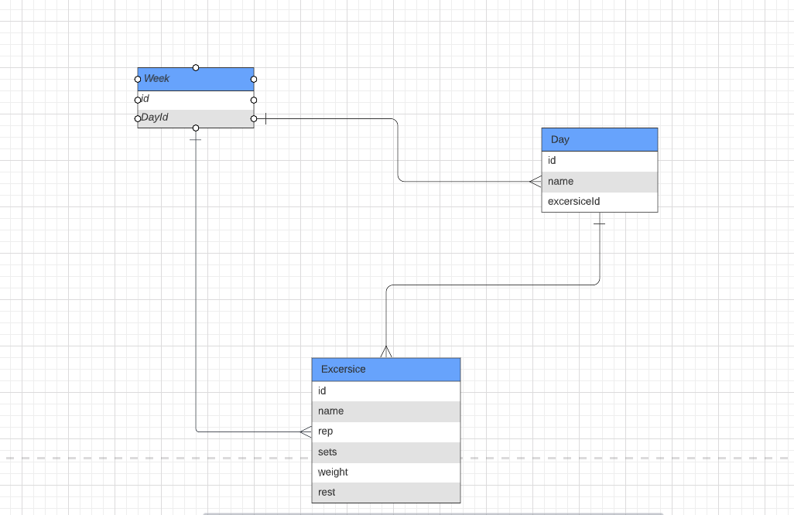
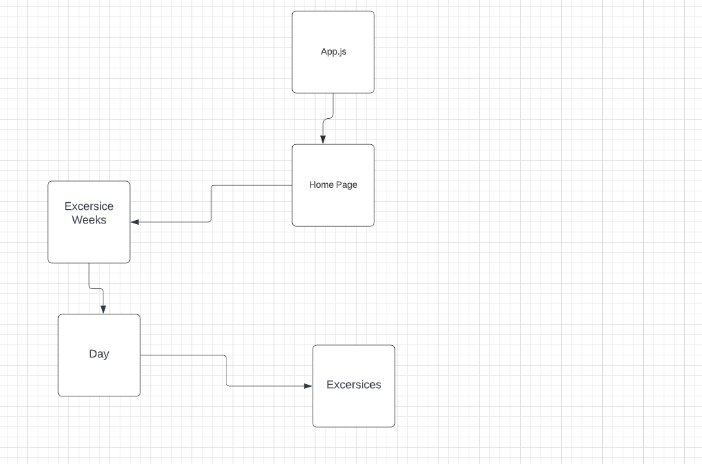

# The Exercise Log

## Summary
Have you found it hard to track your progress in the gym? Been using the same weight for 3 months? With this app, you will be able to keep track of your weights for every exercise that you do. Say goodbye to those old habits of not tracking your gym progression. Remember, you gotta add progressive overload!

### Database/ Collections

For our database, we will be giving you the chance to track your workouts throughout the weeks and ensure that you're getting the most out of your workouts!

### Controllers

We will create controller methods to access the entries from each collection, and have a full CRUD so that you can customize your input if you make a mistake.

### Component Hierarchy

### Brynner Ventura

### [LinkedIn](https://www.linkedin.com/in/brynner-ventura/)
### [GitHub](https://github.com/Brynner03)

## Resources:

### [Lucid ERD Diagram](https://lucid.app/lucidchart/a301fffe-ecaa-4a94-988f-6e1dff45c9bc/edit?page=0_0&invitationId=inv_b387f918-8b19-4cd0-a276-69090221767a#)
### [TrelloBoard](https://trello.com/b/gOOcQYeG/excersice-trello-board)

